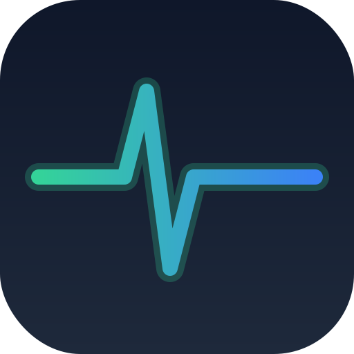
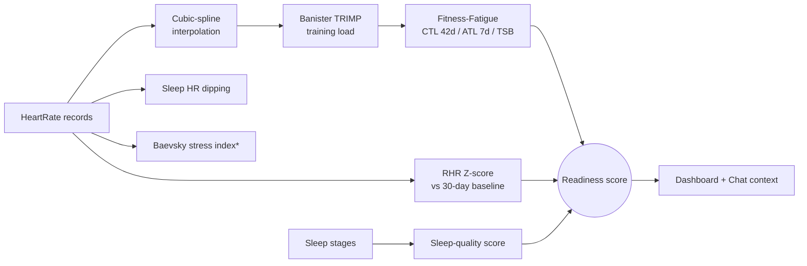
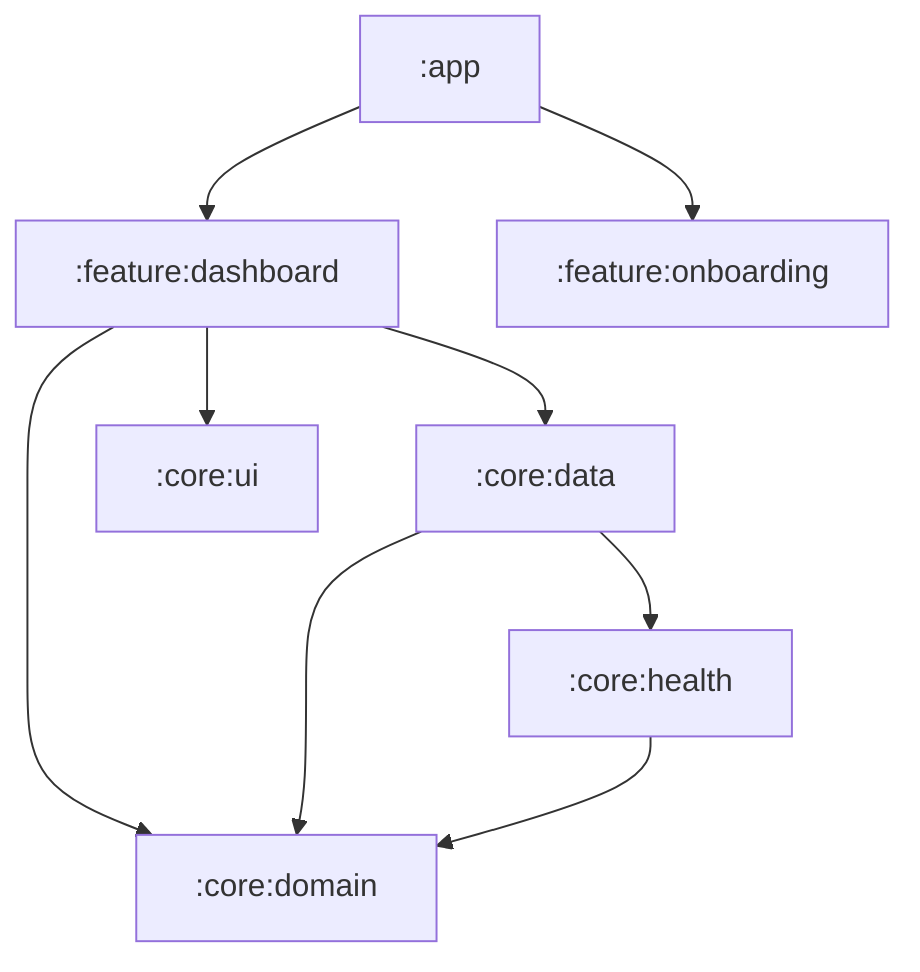

<p align="center">
  
</p>

<h1 align="center">HealthTwin</h1>

**An Android health companion that turns passive wearable data into a daily "Readiness" score — with all the biometric math running on-device, and a privacy-first design where raw health data never leaves the phone.**


> **How this was built:** this project was developed by a single engineer using **AI coding agents under human direction** (see [Built with AI agents](#-built-with-ai-agents-human-directed)). Architecture, the product pivot, the choice of biometric algorithms, and all review were human decisions; the agents accelerated implementation. I think transparency about this is more credible than pretending otherwise — and orchestrating agents to ship non-trivial software is itself part of the skill set on display here.

> ⚠️ **Project status — read this first.** This is a **working proof-of-concept**, not a shipped product. The on-device engine and UI run on real Health Connect data. The AI-coach backend **runs only locally** (the app points at a LAN address) and is **not deployed**, so sign-in and chat do not work out-of-the-box for a fresh install. See [Known limitations](#known-limitations).

---

## What it does

- **Passive sensing** — reads steps, heart rate, sleep (with stages), SpO₂, calories, distance and BMR from **Android Health Connect**. No active measurements, no friction.
- **On-device biometric engine** — derives a **Readiness score (0–100)** and supporting metrics from the raw signals (see below).
- **Dashboard** — expandable metric cards; a Heart-Rate detail screen surfaces the full Readiness breakdown, training load and recovery trends.
- **AI health coach (chat)** — a conversational layer that receives **only aggregated metrics** (not raw data) and replies with contextual, plain-language feedback.

## The interesting part: the biometric engine

The core of the project is a **pure-Kotlin, fully unit-tested** signal-processing pipeline (`core:domain`) that reconstructs a physiological picture from sparse, minute-level wearable data:



- **Cubic-spline interpolation** to fill gaps in irregular HR series (caps at 5-minute gaps).
- **Banister TRIMP** for per-session training load (sex-specific coefficients).
- **Fitness–Fatigue model**: CTL (42-day EWMA), ATL (7-day EWMA), and TSB ("form").
- **RHR anomaly detection** via Z-score against a 30-day baseline, with GREEN/YELLOW/RED alert bands (an early illness/overtraining signal).
- **Sleep HR "dipping" ratio** and a **sleep-quality score** from sleep architecture (deep/REM/WASO).
- **Readiness** = `40% sleep + 30% RHR + 20% training + 10% volatility`, with an illness override (Z ≥ 2.5 caps the score at 30).

\* The Baevsky stress index is **experimental** — see [Known limitations](#known-limitations).

The math lives in `BiometricMathUtils` and is orchestrated by `BiometricEngineUseCase`, covered by **32 unit tests** (`core:domain/src/test/...`). Because it's plain Kotlin with no Android dependencies, it's deterministic and testable without an emulator.

## Architecture

Multi-module Clean Architecture. The domain layer is pure Kotlin and depends on nothing Android-specific.



- **`core:domain`** — entities + use cases (the biometric engine). Pure Kotlin, KMP-friendly.
- **`core:health`** — Health Connect adapter; reads records and returns DTOs.
- **`core:data`** — repositories, **Room** (offline-first single source of truth), **WorkManager** sync, Retrofit chat client, encryption.
- **`core:ui`** — Compose design system (theme, components, charts).
- **`feature:dashboard` / `feature:onboarding`** — screens + ViewModels.

**Offline-first:** the UI observes the local Room database, never Health Connect directly. A `WorkManager` job ingests data and uses the **Changes API** for differential sync.

## Privacy by design (edge-first)

- The **local database is encrypted** with **SQLCipher**; the passphrase is generated per-install and stored in `EncryptedSharedPreferences` behind an **AES-256-GCM master key in the Android Keystore (TEE)** (`SecureKeyManager`).
- The chat backend is an **"insight receiver"**: it gets **only aggregated metrics** (e.g. `readiness: 78`, `sleep_debt_min: 45`), never raw beat-by-beat or sleep logs. Raw time-series stay on the device.

## Tech stack

| Area | Choice |
| --- | --- |
| Language / build | Kotlin **2.1.0**, AGP **8.13.2**, Gradle **8.13**, Java 17 |
| UI | Jetpack **Compose** (BOM 2024.12.01), Material 3, Navigation Compose |
| DI | **Hilt** 2.54 |
| Persistence | **Room** 2.6.1 + **SQLCipher**, DataStore, **WorkManager** |
| Health | **Health Connect** client (1.1.0-alpha10) |
| Networking | Retrofit 2.11 + OkHttp 4.12 |
| Auth/cloud | Firebase Auth + Firestore (emulator in dev) |
| Async | Coroutines / Flow 1.9 |
| Min / target SDK | 28 / 35 |

## Build & run

```bash
git clone <repo-url>
cd ai_health_android
./gradlew assembleDebug
```

- **Firebase config is not committed.** Copy `app/google-services.json.example` to `app/google-services.json` and fill in your own Firebase project's values (download it from the Firebase console).
- The **dashboard and on-device engine work** against any Health Connect data source (install a wearable companion app, or seed data via Health Connect).
- **Sign-in and chat require the backend.** The app currently targets a local address (`NetworkModule.CHAT_BASE_URL`) and Firebase **emulators**. To use them you must run the FastAPI backend + Firebase Emulator Suite on your LAN and point the app at them. Deploying the backend is the first item in [`docs/PORTFOLIO_CHECKLIST.md`](docs/PORTFOLIO_CHECKLIST.md).

## 🤖 Built with AI agents (human-directed)

This codebase was produced through **AI-assisted, human-directed engineering**. I (the author) drove the project end to end; AI coding agents did much of the typing.

**What was human (mine):**
- Product direction and the strategic **pivot** (dropping camera-based vPPG/HRV in favour of passive sensing — see the case study).
- Architecture and module boundaries; the offline-first / edge-first privacy model.
- Selecting and specifying the biometric algorithms (TRIMP, Fitness-Fatigue, Z-score, Readiness weighting) and their thresholds.
- Reviewing, integrating, debugging and testing on real wearable data.

**What the agents did:** scaffolding, large chunks of implementation, boilerplate, and first-draft tests — all under review.

I document this deliberately. The realistic skill on display is not "I typed every line" — it's **scoping a non-trivial health app, making the hard product and architecture calls, and steering AI agents to implement them while keeping quality under control.**

## Known limitations

Being honest about the gaps is part of the point:

- **Backend not deployed** — chat/auth point at a local machine; not usable by a fresh install today.
- **Experimental stress index** — the Baevsky index is derived from minute-level HR (`RR = 60 / BPM`), **not true beat-to-beat HRV**. Treat it as exploratory, not clinical.
- **Biometric profile is partly hardcoded** in the chat path (HRmax, sex) — needs personalisation.
- **Test coverage is concentrated** in the biometric engine; networking/sync/UI are largely untested.
- **Single-user**, **dark-mode only**, no in-app medical disclaimer yet.
- **Not medical advice.** This is a wellness/experimental project and must not be used for diagnosis.

## License

Released under the [MIT License](LICENSE) © 2026 Angelo Quartarone.

---

_Project name in code: package `com.ai_health.assistant`, display name **HealthTwin**._
